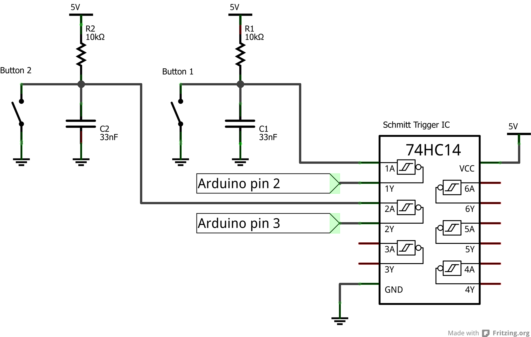
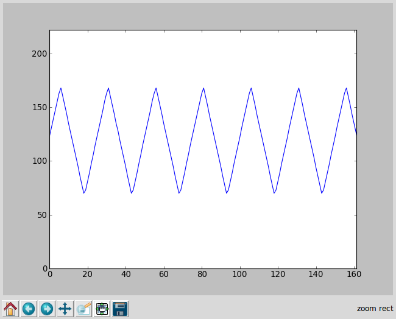

                                                                    
                                                                     
                                             
# 1	Introduction to Arduino and the Arduino IDE #

----------

**This set of tutorials requires and Arduino Uno. It also requires a computer running linux. Throughout this set of tutorials I will typically refer to the computer being used as the "Pi" as this documentation was written specifically for the Raspberry Pi. However you can follow these tutorials using any other computer running Linux. Obviously an "ordinary" computer will be significantly faster then using a Pi!**

## 1.1	Installing the Arduino IDE ##

Here is a link to the getting started with Arduino page. This goes through everything you need to do to install the Arduino software, connect your Arduino and run your first program on the board:

[http://arduino.cc/en/Guide/HomePage](http://arduino.cc/en/Guide/HomePage)

To install the Arduino IDE type into the terminal:

	sudo apt-get install arduino

## 1.2	What is an Arduino? ##

The Introduction section in the above page gives a description of what the Arduino is and why you would want to use it so feel free to read this additionally if interested. 

The Arduino is a Single-Board microcontroller, from Wikipedia:

*A single-board microcontroller is a microcontroller built onto a single printed circuit board. This board provides all of the circuitry necessary for a useful control task: microprocessor, I/O circuits, clock generator, RAM, stored program memory and any support ICs necessary. The intention is that the board is immediately useful to an application developer, without needing to spend time and effort in developing the controller hardware.*

Arduino is based on a development platform called Wiring:

*Wiring is an open source electronics prototyping platform composed of a programming language, an integrated development environment (IDE), and a single-board microcontroller.*

The key piece of hardware that your board contains is a microcontroller, for the Uno that’s an ATMega328. As well as this microcontroller there are also additional pieces of hardware on the Arduino board such as many input and output pins. Together this means that you can plug your Arduino straight out of the box and into your PC and immediately begin programming. This type of board provides an excellent way of learning how to use microcontrollers. As well as the hardware Arduino also provides a software package from which you can write and upload programs to your Arduino board. We can think of the software package in two parts: the Arduino IDE (integrated development environment), and the programming language used to write programs for the Arduino. 

The Arduino IDE allows you to write, compile and upload code to your Arduino board as well as monitor the serial port between your computer and the Arduino. Programs for the Arduino must be written in C++. The key feature of the Arduino IDE is that it includes the “Wiring” library mentioned above. This provides function calls for many common input / output operations associated with using microcontrollers. For example we may want to use the analog to digital converter on the Arduino to sample a voltage on the analog input pin 0. This can be done using the function `analogRead(0)`. This is the functionality that the `analogRead()` function is actually implementing (on the Uno - this is not the full code found in the function, there is a load of code which selects the correct pin to use but I've left this out):

    int analogRead(uint8_t pin)
    {
    	uint8_t low, high;
    
    	if (pin >= 14) pin -= 14; 
    
    	ADMUX = (analog_reference << 6) | (pin & 0x07);
    
    	sbi(ADCSRA, ADSC);
    
    	while (bit_is_set(ADCSRA, ADSC));
    
    	low  = ADCL;
    	high = ADCH;
    
    	return (high << 8) | low;
    }

Hopefully this demonstrates how useful these standard function calls are in simplifying the use of the microcontroller. What is actually happening in the `analogRead()` function is that different registers (we will talk about register later) within the microcontroller are being addressed, and through addressing these different registers we obtain the desired operation of the ADC. The `analogRead()` function allows us to operate the ADC without having to address a single register, and this is a common feature of the Arduino IDE, you can write programs just using the inbuilt functions.

## 1.3	Arduino Sketches ##

An Arduino sketch is always based around two functions, the `setup()` and `loop()` functions. These functions must always be included in your sketch. The `setup()` function runs once at the start of the program. In this function you want to place code used to setup and configure the Arduino that only needs to be run once. The loop function is simply an infinite loop in which the code is executed again and again. The first loop of the `loop()` function runs as soon as the `setup()` function has finished. Of course we can define other functions in our program and call them from both the `setup()` and `loop()` functions. 

This page gives a huge number of basic tutorials covering the functionality of the wiring library:

http://wiring.org.co/learning/basics/

Here is an example of a simple sketch to print a value every 1 second from the ADC and the time at which the sample was taken. File name: **simpleDAQ.ino**

In the `setup()` we start serial communication at 9600 baud (we will talk in more detail about serial later in section 2.1)

    void setup()
    {
      // Begin serial communication at 9600 baud
      Serial.begin(9600);
    }

In the loop function we first take an ADC reading and store it in `analogValue`. Then we find the current system time in micro seconds using the `micros()` function, and store it in the `sampletime` variable (first we scale the value from microseconds to seconds by dividing by 1000000):

    void loop()
    {
      // Read a single ADC value
      analogValue = analogRead(0);
      // Find system time
      sampletime = micros()/1000000.0;
  

Once this is done we print the two characters across serial. `Serial.println()` adds `\n` to the end of whatever we are sending. This is used to represent “carriage return” or the end of a line, so that each time we print the sample value and sample time they appear on a new line. Finally we delay for 1000ms so that data is sampled at approximately one second intervals:

	  // Print the ADC value and time over serial
	  Serial.print(analogValue);
	  Serial.print("  ");
	  Serial.println(sampletime,6);// Print to 6 significant figures
	  
	  // Delay for 1 second
	  delay(1000); 
	}

## 1.4	Running the Script ##

First make sure you have a setup that allows you to vary the voltage input to the ADC. The simplest way to do this is using a potential divider placed across the input pin A0 of the board. 

Upload the code to your Arduino board and then open the serial monitor. Ensure the baud rate of the serial monitor is set to 9600. You should now see the sample value and time printed to the screen, adjust the potential divider and check that the sample value changes accordingly. 

# 2	Communicating between the Arduino and Pi #

----------

There are three commonly used methods for communication between hardware components. A very brief outline of the different methods is given here. I’ve linked some more in-depth guides but reading these is not necessary:

[http://www.byteparadigm.com/applications/introduction-to-i2c-and-spi-protocols/](http://www.byteparadigm.com/applications/introduction-to-i2c-and-spi-protocols/)

* Serial
	* A two wire bus, with transmit and receive lines (commonly referred to as Tx and Rx). Data transfer is asynchronous as the two devices do not communicate with a shared clock. This means that on each device the desired speed of communication (given by the baud rate – or bits per second) must be specified, and the baud rates of the two devices must be the same. Data rates are typically lower then I2C and SPI, however Serial is the simplest of the three methods to use. On the Arduino Uno we can communicate with serial up to speeds of around 50kB/s.
* I2C
	* A four wire bus, although two of these wires are a common Vcc and Gnd connection. The other two are a common serial clock line, and a common serial data line. Communication is synchronous (components communicate using a shared clock generated by the master device). Speeds are typically 100kB/s but there is also a 400kB/s fast mode. Many components can be connected on a single bus (typically 7 bit address space giving a bus size of 128 components).  The bus typically contains one master and many slaves. Communication always occurs between a master and a slave device, with the mater initiating the communication. The master can only communicated with one slave at a time.
* SPI
	* A four wire bus, with a serial clock line, a master output slave input line, a slave output mater input line, and a slave select line. Multiple slaves are possible for SPI but each slave must have its own slave select line, so the number of slave select lines will be the same as the number of slaves. Communication is again synchronous with the clock generated by the master device. The speed of SPI is determined by the clock speed used by the master, speeds can go up to 10Mb/s, so is typically faster than I2C and Serial. 

For the following tutorials all communication between the Pi and Arduino will be done using Serial. The reasons for this are as follows:

* Serial is simple and easy to use.

* We can communicate using serial protocol down the USB cable connecting the Arduino to the Pi. The Pi runs at 3.3V while the Arduino Uno runs at 5V, this means that you cannot connect pins on the two devices together unless you use a level shifter to convert the two voltages. Without a level shifter you may break your Pi / the lifetime of your Pi will be significantly shortened. By communicating down the USB cable we avoid this problem. For both SPI and I2C level shifters would be needed. 

* The above point means that if you want to follow these tutorials using a laptop rather than a Pi then you can connect the Arduino via the usb cable to your Laptop. With SPI and I2C this would not be possible as your laptop doesn’t have a set of GPIO pins. 

* The speed of the serial connection is not as much of a limitation as it may seem. Once the ADC on the Arduino samples at a rate greater than 15ksps then the effective resolution of the conversion begins to drop below 10 bits. The maximum rate that the Arduino is capable of sampling is around 170ksps, so data transfer of an order of magnitude somewhere around 15-170ksps is suitable for our purposes, which 50ksps is.

It turns out that when sampling continuously we do become limited by the rate at which we can transfer across serial. My plan originally was to go back and modify the programs to perform the same functionality using I2C and SPI, but I have not had time to implement this. 

## 2.1	How Serial Communication Works  ##

Serial communication works as follows:

First we initialise serial communication on the two devices that will be communicating with each other, all this requires is specifying the baud rate (number of bits per second) of the serial communication. This baud rate must be the same on both devices communicating. The baud rate is derived from the system clock. The speed of the baud rate is found by dividing the system clock by some integer value. This means that if the system clock is not divisible by the desired baud rate then the baud rate will in fact be different to that which we specified. The system clock in the Arduino is 16Mhz. For example if we try to set our baud rate to 700 000, then the actual baud rate will be 16 000 000 / 27 = 592 592. Giving an error of 1.2%. However if we set the baud rate to say 500 000 then the error would be zero. The serial connection can tolerate small errors in baud rate like this, however this reduces noise margins in the system. Page 193 of the data sheet ([www.atmel.com/Images/doc8161.pdf](www.atmel.com/Images/doc8161.pdf)) has tables listing the acceptable error mismatch between the baud rates of the two devices. For the following tutorials we will use baud rates with 0% error to avoid this problem completely. A table of different baud rates with the corresponding errors is shown on page 203 of the datasheet. Notice that baud rates of 500 000, 1 000 000 have 0% error and we will use these two baud rates in the following programs.

When data is sent down the transmit line of one device (this line is the receive line of the second device), then on the receiving device the data is read and placed into a serial buffer. We transmit and receive data in bytes. The serial buffer contains bytes of data that have been received from the receive serial line. The device can then read the contents of the serial buffer to access the serial information that it has received. There are a number of key functions involving the serial buffer that we will use:

* A function that returns the number of bytes in the serial buffer. Each time a new byte is received across serial the size of the buffer will grow by one byte. Each time we read a byte of data from the serial buffer the byte that we read is removed from the buffer, so the size of the buffer reduced by one byte (if we read multiple bytes then the size of the buffer is reduced by the same amount as the number of bytes we read)

* A function to write data across the serial connection. 

* A function to read data from the serial input buffer, this typically involves specifying the number of bytes that we want to read.

It is worth mentioning quickly about the serial writing functions on the Arduino. First we need to talk about ascii characters:

http://en.wikipedia.org/wiki/ASCII

Taken from [http://www.asciitable.com/](http://www.asciitable.com/):

The ascii scheme is simply a way of encoding bytes of information as characters. The important columns in the above table are the “Dec” column and the “Char” column. All characters are encoded from a single byte of information (0-255 in decimal). In the above table the “Dec” column gives the binary value (in decimal) while the “char” column gives the character that this binary value is encoded as.

The Arduino has two different functions:

    Serial.print()

This function sends the data in the ascii encoding scheme. 

    Serial.write() 

This function sends the data as binary values. The different between these two functions is easy to see with an example:

    Serial.print(132)

Will send the ascii characters “1” “3” “2” across serial, meaning that it will send three bytes: 49, 51, 50 across serial.

    Serial.write(132)

Will just send one byte: 132 across serial. 

Lastly:

    Serial.println()

Adds the ascii characters `\r\n` to the end of what you print across serial. This corresponds to starting a new line after your message has been sent. The serial monitor built in to the Arduino IDE interprets data sent as “ascii” characters. This means that if we want to use the serial monitor to read data sent from the Arduino we need to send the data using the `Serial.print()` function.

Note also that when using pySerial (mentioned below) the serial input buffer has a maximum size of 4096 bytes, while the serial input buffer on the Arduino has a maximum size of 64 bytes.

## 2.2	Installing pySerial and other Python libraries ##

To communicate with the Arduino we will use python combined with the pyserial library. First update your Pi:

    sudo apt-get update
    sudo apt-get upgrade

Then install pyserial:

    sudo apt-get install pyserial

We will also need the python packages installed in section 6 of the Pi+ADS1115 Tutorial if not already installed:

    sudo apt-get install ipython python-numpy python-scipy python-matplotlib

These packages allow us to use the ipython pylab environment.To use this environment first set the working directory to the location of the python script that you are going to run. Then type `sudo ipython`. Wait for ipython to load then type `pylab`. This allows us to manipulate variables used in programs after they have run, and provides easy to use plotting options. This is also mentioned in **Section 6** of the Pi+ADS1115 tutorials. 

## 2.3	pySerial Function Calls ##

Here are a list of the functions available as part of the pySerial library:

http://pyserial.sourceforge.net/pyserial_api.html

And a list of basic examples:

http://pyserial.sourceforge.net/shortintro.html

## 2.4	Simple Serial Echo ##

We will now demonstrate a simple echo example. Here the user inputs a string into the terminal window. This string is sent via serial to the Arduino, which reads and then writes the string back to the serial port. The Pi then reads whatever the Pi has sent back and prints it back to the terminal. We will know if our programs are working as we should get the same string back from the Arduino as we sent to it.

Firstly the Arduino script. File Name: `arduino_echo_py.ino`

We will show the whole sketch here as it is very short:

	void setup()
	{
	  // Start Serial communication at 250 000 baud
	  Serial.begin(250000);
	}
	
	void loop()
	{
	  // If there are bytes available in the serial input buffer
	  if (Serial.available()) 
	  {
	    // Read a single byte and write it back over serial
	    Serial.write(Serial.read());
	  }
	}

The setup is again straightforward, we begin serial communication at 250 000 baud. Remember from section 2.1 that this is a 0% baud rate for the Arduino. This baud rate isn’t supported on the serial monitor built into the Arduino so you won’t be able to communicate with this sketch in that way. In the loop function we continuously check if there are bytes of data available in the serial input buffer. If there are then we read a single byte and write it straight back over serial. In this way we echo whatever the Arduino receives across serial strait back over serial.

----------

Now for the python sketch. File name: `arduino_echo_python.py`

This sketch can be loosely split into two parts. The first part opens the serial port to the Arduino. A serial connection on your PC acts like a file that you can read or write from. If we write data to the file it is sent across the serial connection. Likewise if we read data from the file we read data from the serial input buffer. When you connect the Arduino to your PC this “serial” file will be created. This file name will have the name `/dev/ttyUSBx` where `x` is a number. I found that when I first connected the Arduino `x` was set to 0, and each time I reconnected the Arduino `x` was increased by 1, however this could vary from system to system, the assignment is essentially a little bit random!

You can find the name of the file by setting your directory to the `/dev` folder. Then type `ls` to see a list of files. Then connect your Arduino and type `ls` again and watch for the new file created. This is the file we need to connect to in order to open the serial port. Alternatively when you connect the Arduino to the Pi you can enter the Arduino IDE, and then go to Tools->Serial Port to see which serial port the Arduino has been assigned. You could then go into the python sketch and change the `/dev/ttyUSB` line in the code so that it matches with the serial port the Pi is connected to. The code used in the above sketch however scans over a range of serial ports USB0 to USB9 and attempts to connect to each in turn. If it doesn’t find a serial port then the script exits. Note that it is possible that the serial port could have a number higher then USB9! This is the part of the code that scans the serial ports:

    portname_start = '/dev/ttyUSB'
    
    # Try opening serial ports /dev/ttyUSB0->9
    for i in range (0, 10):
    	# Change i to a string
    	portnum = str(i)	
    	# Append "i" to the end of portname_start										
    	portname_full=''.join([portname_start,portnum])
    	# Try to open the serial port with i, if this fails try again with i+1
    	try:
    		ser = serial.Serial(portname_full, 250000, timeout =1)
    		break
    	except:
    		# If we reach i==9 and no port has been opened, exit and print error message
    		if (i==9):
    			print "No Serial Port Found"
    			sys.exit(0)

The rest of the python script should be self-explanatory. We enter a loop in which we repeatedly ask the user to input a string. This string is written to the Arduino. We wait for the same number of bytes that we sent to be echoed back to the serial input buffer. Then we read these bytes from the buffer and print them to the terminal. The string echoed back by the Arduino should be identical to the one sent by the user:

	while True:
		# Get string to send to Arduino from user
		stringToSend = raw_input ("Enter string to send to Arduino: ")
		# If user inputs "EXIT" break from the while loop
		if (stringToSend == "EXIT"):
			break
		# Write the string to the Arduino
		ser.write(stringToSend)
		# Wait until we recieve back the same number of bytes as we sent
		while(ser.inWaiting() < len(stringToSend)):
			pass
		# Read the string in the serial input buffer
		stringRecieved = ser.read(len(stringToSend))
		
		print "String recieved from Arduino: ", stringRecieved

### 2.4.1 Running the Echo Example ###

First upload the Arduino sketch to your Arduino board. Then set the working directory to wherever you have saved the python script. Then simply run the python script. In the screen shots below I am running the script from `ipython-pylab`.

 

# 3	Addressing Registers on the Arduino #

----------

In section 1.2 we looked at the code that was being run by the `analogRead()` function and noted that it involved addressing certain registers on the ATMega328. It is often useful to address registers directly rather than simply relying on the functions using in the wiring library. But what exactly is a register? A register is simply a memory location within the ATMega328. Each register is a single byte of data. Depending on the state (0 or 1) of the bits within a register it causes the microcontroller to react in a certain way. For example an ADC conversion is triggered by the value of a bit in a specific register being changed from a 0 to 1. Say we wanted to then initialise an ADC conversion, what register do we need to use, and which of the eight bits in this register do we need to set to 1? Within our program how do we actually set this bit using C++ code? For the first of these questions this is where the datasheet of the microcontroller comes in:

[www.atmel.com/Images/doc8161.pdf](www.atmel.com/Images/doc8161.pdf)

The datasheet lists all of the microcontrollers registers, and for each register gives a description of the function of each of the eight bits. Each register has its own name as does each bit within the register. Look at page 263 of the datasheet linked above. Here you will see the ADCSRA register. Bit 6 of this register is the ADSC: ADC Start Conversion bit. This is the bit we need to set to start the conversion, as the description in the datasheet explains. Note how under the description of the register it also displays whether each bit is read (R ), write(W) or read and write (R/W). Also we see the address of the register, here 0x7A.  Using registers is really that simple, the difficultly often comes from having to read through the very long 488 page datasheet to find the functionally that you require. 

## 3.1	Setting Registers within the Arduino IDE ##

To set a register you type the name of the register and set it equal to its desired value. Note that you set the value of the register, not individual bits. Say we want to set the ADCSRA register mentioned above to 11000111. We can set the register as binary, decimal or hex:

`ADCSRA = 0b11000111`

`ADCSRA = 199`

`ADCSRA = 0xC7`

These three commands perform the same function. To set an entire register this way requires knowledge of what all eight bits in the register should be, normally we are interested in changing the value of a single bit, for example the ADSC bit mentioned above. To set the ADSC bit to 1:

`ADCSRA |= (1<<6)`

If you are not familiar with bitwise operators in C++ they are summarised on this Wikipedia page:

http://en.wikipedia.org/wiki/Bitwise_operations_in_C

`|=` is the “OR equals” operator. This sets the value of the variable to the left of the operator equal to its old value ORed with the number to the right of the operator. `(1<<6)` takes the number 1 and binary shifts it by six places to the left (as ADSC is the 6th bit in the register). Thus the new value of ADCSRA is equal to the old value ORed with 01000000. Whatever the old value of ADSC was, as it is now ORed with 1 the new value will be set to 1. All the other bits of ADCSRA are ORed with 0 so their value does not change. A simpler to use and more readable version of the above syntax is:

`ADCSRA |= (1<<ADSC)`

This binary shifts 1 to the left until it corresponds to the position of the ADSC bit.

To set a bit to 0:

`ADCSRA &= ~(1<<ADSC)`

The `~` symbol performs bit inversion. This means that we “AND equal” the old value of ADCSRA with 10111111. ADSC is then set to 0 and all other bits are unaffected.

Another commonly used method is to define two macros at the start of a sketch:

	#ifndef cbi
	#define cbi(sfr, bit) (_SFR_BYTE(sfr) &= ~_BV(bit))
	#endif
	
	#ifndef sbi
	#define sbi(sfr, bit) (_SFR_BYTE(sfr) |= _BV(bit))
	#endif 

Then if we want to set a bit equal to 1 we just type:

`sbi(ADCSRA, ADSC)`

And to 0:

`cbi(ADCSRA, ADSC)`

## 3.2	analogRead Example ##

Here we go through the `analogRead()` function that we posted previously and explain how this function works:

	int analogRead(uint8_t pin)
	{
		uint8_t low, high;
	
		ADMUX = (analog_reference << 6) | (pin & 0x07);
	
		sbi(ADCSRA, ADSC);
	
		while (bit_is_set(ADCSRA, ADSC));
	
		low  = ADCL;
		high = ADCH;
	
		return (high << 8) | low;
	}

We are reading a 10 bit sample, so we must create two unsigned 8 bit numbers (or bytes!) to store the sampled value in. This is because the result of the conversion is stored within two eight bit registers, we need to read the value of both of these registers and then combine the two eight bit numbers to get our final result.

    uint8_t low, high;

ADMUX can be found on page 262 of the datasheet. This line sets REFS0 (bit 6) to the value of `analog_reference` variable. 

		ADMUX = (analog_reference << 6) | (pin & 0x07);

`analog_reference` is equal to 1 by default meaning the reference voltage for the ADC is given by Vcc. The four bits MUX3:0 in the ADMUX register sets which of the input pins is used as the source of the ADC as shown in Table 23-4. Note that as MUX3:0 are the least significant bits of the register, the number of the input pin maps to the binary value of MUX3:0, i.e. ADC5 requires MUX3:0 to be 0101 (5 in decimal). This means we can convert the value of the desired input pin to the ADC to a three bit number by ANDing its value with 0x07  and then (after adding the value of bit REFS0 using the OR operation) set ADMUX equal to this value.

		sbi(ADCSRA, ADSC);
 
As previously discussed the line of code above starts the ADC conversion.

		while (bit_is_set(ADCSRA, ADSC));

The line above waits while the bit ADSC in the ADCSRA register is set to 1. The ADC takes 13 clock cycles to complete so after starting the conversion we must wait before we read the result. Once the result is read the ADSC bit is set from 1 back to 0. 

		low  = ADCL;
		high = ADCH;

		return (high << 8) | low;

The result of the conversion is stored in two registers ADCL and ADCH, we combine these two bits to form our 10 bit result and return this value from the function.

A more in-depth explanation of the above function can be found here:

http://garretlab.web.fc2.com/en/arduino/inside/arduino/wiring_analog.c/analogRead.html

# 4	Interrupts #

----------

An interrupt is something that interrupts the current activity of the processor and switches it to working on a different task. In the case of your Arduino say your processor is executing code within your `loop()`. If an interrupt is triggered the processor then immediately switches to another function called an interrupt service routine (ISR). The processor then executes whatever code is found within the ISR and once this code is executed it goes straight back to wherever it left of from before the interrupt was triggered. A typical example of where an interrupt would be useful is if we want to monitor the status of an input pin to the Arduino. Normally we would have to check the status on the pin continuously as it could change at any time. In this case the processor would spend its entire time checking the state of the pin, and never having time to do anything else. However if we set up an interrupt so that it triggers when the state of the pin changes, then in our main loop we can set the Arduino to work on something completely different yet still catch the change of state on the pin.

In pseudo-code this would look something like the following:

	void setup()
	{
	   Set up external interrupt by setting the appropriate registers
	}
	
	void loop()
	{
	   Do something here
	}
	
	ISR function
	{
	   Detect the change in the pin
	}

To use an interrupt we perform the following steps:

* Configure the appropriate registers so that the interrupt operates as desired
* Enable the desired interrupt (this is done by setting a certain bit within a register)
* Define an ISR for the interrupt and program what happens within this ISR

An ISR is defined as follows:

	ISR(interrupt_vect)
	{
		// Enter Code Here //
	}

The `interrupt_vect` specifies which interrupt triggers the ISR, a table of the different interrupts is found on page 65 of the data sheet. Of these interrupts only three types will be used in the following documentation: **External Interrupt Request**, **Timer 1 Compare A / B Match**, and **ADC Conversion Complete**. The `interrupt_vect` consists of the name of the source of the interrupt on page 65, followed by `_vect`. As an example External interrupt request 0 would have its ISR defined as follows:

    ISR(INT0_vect)
    {
    	// Enter Code Here //
    }

Some general points for using interrupts:

* Any variables modified within and outside of an ISR should be declared as volatile
* Interrupt routines should be kept as short as possible, only put the code that is needed specifically within the ISR in the ISR, any code that could be placed within your `loop()` function should be
* Avoid function calls within your ISR that use interrupts themselves. This can be hard to determine when you don’t know what is going on within functions, for now avoid any `Serial.` function calls. 
* When configuring registers to set up / enable interrupts it is good practice to disable global interrupts before you begin configuring using `cli()` and enable them again when done using `sei()`. Otherwise you may change the operation of your interrupts half way through configuring leading to unexpected behaviour. 

## 4.1	External Interrupt Example ##

For this example you should have two debounced push switches connected to input pins 2 and 3 of your Arduino. This is the hardware setup that I used for this:

In this example we will use External Interrupt Request 0 (triggered by digital input pin 2 on the Arduino board) and External Interrupt Request 1 (triggered by digital input pin 3). Both of these two pins will have a pushbutton connected to them allowing us to manually trigger the two interrupts. When an interrupt is triggered we will print a message across serial notifying us that a button has been pressed.

### 4.1.1	Configuring the Interrupts ###

This will requires setting only a single register EICRA (page 71). Only four bits are used in this register, these bits allow us set what event on each input pin causes the interrupt to trigger as seen in tables 12-1 and 12-2:

* A low level
* Any logic change (a falling or rising edge)
* A falling edge only
* A rising edge only

We will set both buttons to trigger on a rising edge. For interrupt 1 we must set bits:

`ISC11 = 1`

`ISC10 = 1`

And for interrupt 0:

`ISC01 = 1`

`ISC00 = 1`

### 4.1.2	Enabling the Interrupts ###

Enabling the interrupts is done within register EIMSK (page 72).

To enable interrupt 1 we need bit:

`INT1 = 1`

And for interrupt 0:

`INT0 = 1`

### 4.1.3	Arduino Sketch ###

File name: `ext_int_example.ino`

It is worth mentioning certain lines / sections of code from the above example:

In the sketch first we start serial communication in the `setup()` function. Then we call `extIntSetup()` which configures the appropriate registers for the desired external interrupt operation, finally we call `extIntStart()` which enables the interrupts:

	void extIntSetup()
	{
	  // Disble global interrupts
	  cli();
	  // External Interrupt 0 generated by rising edge on INT0
	  EICRA |= (1 << ISC01);
	  EICRA |= (1 << ISC00);
	
	  // External Interrupt 1 generated by rising edge on INT1
	  EICRA |= (1 << ISC11);
	  EICRA |= (1 << ISC10);
	  // Enable global interrupts
	  sei();
	}

This follows directly from 12.1.1

	void extIntStart()
	{
	  // Disble global interrupts
	  cli();
	  // Enable External Interrupt 0 and 1
	  EIMSK |= (1 << INT0);
	  EIMSK |= (1 << INT1);
	  // Enable global interrupts
	  sei();
	}

While this follows directly from 12.1.2

	// External interrupt 0 (pin 2) ISR
	ISR(INT0_vect)
	{
	  button1 = true;
	}
	
	// External interrupt 1 (pin 3) ISR
	ISR(INT1_vect)
	{
	  button2 = true;
	}

Here we define the two ISRs for each external interrupt. In each ISR we have flags `button1` and `button2`, each ISR sets the value of its flag to true to represent the interrupt has been triggered, and we can then check the value of the two flags within the `loop()` to see if an interrupt has occurred. If an interrupt has occurred the `loop()` function detects this and prints a notification across serial.

### 4.1.4 Running the Sketch ###

Simply upload the sketch to your Arduino Uno. Then open the serial monitor. Pressing either of the two push buttons should result in a corresponding notice printed out across serial:

## 4.2 Timer Interrupt Example ##

Alternative guide:
[http://www.instructables.com/id/Arduino-Timer-Interrupts/](http://www.instructables.com/id/Arduino-Timer-Interrupts/)

### 4.2.1 Configuring the registers ###

The Arduino has three different timers that we can work with: Timer0, Timer1 and Timer2. An important difference between these timers is that Timer0 and Timer2 are 8 bit counters (they have a maximum value of (2^8)-1=255, as the counter starts from 0) while Timer1 is a 16 bit counter (maximum value 65535). Each of these timers has a certain frequency and this frequency determines how many times the value of the counter increments in 1 second.  This frequency is set by choosing a prescaler for each timer. This prescaler is just an integer number that is set within a certain register. The frequency of a timer is formed by dividing the clock on the Arduino (16MHz) by the value of the prescaler. The lowest value of prescaler is of course 1 meaning the maximum frequency of the timers is 16MHz. For a list of available prescalers see table 15-5 on page 137. The values are:

	1, 8, 64, 256, 1024

The timer frequency is given by:

Note that due to the limits (256 and 65536) on the counters there is a finite amount of time that each timer can run for before it reaches its maximum value. If the timer is run in its “normal” mode of operation, then each time this maximum value is reached the value of the timer resets to 0 from where it then counts up again. From the data sheet (page 125):

*The simplest mode of operation is the Normal mode (WGM13:0 = 0). In this mode the counting direction is always up (incrementing), and no counter clear is performed. The counter simply overruns when it passes its maximum 16-bit value (MAX = 0xFFFF) and then restarts from the BOTTOM (0x0000).*

There are many different modes apart from the “normal” mode that the timer can be operated in. Table 15-4 of the different options (for Timer1) is shown on page 136. For now we are only interested in the modes of operation labelled as CTC. This stands for Clear Timer on Compare Match. This mode of operation is similar to the “normal” mode of operation, the difference is that rather than resetting when the timer reaches its maximum value, the timer now resets when it reaches a value defined within a certain register. As we are able to set the value of this register ourselves this means we can choose the value at which the timer resets. From Table 15-4 we can see that for Timer1 there are two different choices of CTC mode. The only difference between the two modes is the TOP register, being either OCR1A or ICR1. Both of these two registers are sixteen bits, and both give the value at which the timer will reset back to 0. We could choose either of these two options for the following example.

We can configure the timer so that when it resets after reaching its maximum value an interrupt is triggered. This allows us to set up a periodically repeating interrupt, the frequency of which is defined by both the timer prescaler and the value of the TOP register. The timers begin counting from 0 so it takes TOP+1 counts before the timer resets (for example if our TOP register was equal to 2, the timer would count 0, 1, 2 and then reset). The frequency at which the timer resets back to 0 and hence the frequency of the interrupt is given by:

For this example we will use Timer1 set in CTC mode with the TOP register equal to OCR1A, and set up an interrupt to trigger at 1Hz. This is a very slow reset rate so we will set the prescaler to its maximum value of 1024, giving the frequency of Timer1 equal to 16 000 000 / 1024 = 15625Hz. The value of OCR1A is then equal to: (15625 / 1) -1 = 15624 to give a 1Hz trigger rate.

Now we need to configure the Timer1 registers to set:

* the prescaler equal to 1024
* the value of OCR1A equal to 15624
* enable CTC mode with TOP register given by OCR1A

This involves setting three different registers: TCCR1A (page 134), TCCR1B (page 136) and OCR1A (page 138). 

**TCCR1A:**

Bits 7:2 are not relevant and will be set to 0.

Bits 1:0 (WGM11 and WGM10), with bits WGM13 and WGM12 in the TCCR1B register set the mode of operation of the timer. As mentioned above we want CTC mode with TOP value given by OCR1A. We can see from table 15-4:

`WGM10 = 0`

`WGM11 = 0`

`WGM12 = 1`

`WGM13 = 0`

We can see that all the bits in TCCR1A are equal to 0, so we can set the entire register to 0!

**TCCR1B:**

Bits 7:5 are not relevant and will be set to 0.

Bits 4:3 correspond to WGM12 and WGM13 above.

Bits 2:0 set the prescaler of Timer1. We want to use 1024:

`CS12 = 1`

`CS11 = 0`

`CS10 = 1`

**OCR1A**

This is the TOP register, which is to be set to 15624 for 1Hz interrupt generation.

### 4.2.2 Enabling the Interrupt ###

The interrupt is enabled by setting bit 1 (ICIE1A) in the TIMSK1 register:

*• Bit 1 – OCIE1A: Timer/Counter1, Output Compare A Match Interrupt Enable
When this bit is written to one, and the I-flag in the Status Register is set (interrupts globally enabled), the Timer/Counter1 Output Compare A Match interrupt is enabled. The corresponding Interrupt Vector (see “Interrupts” on page 57) is executed when the OCF1A Flag, located in TIFR1, is set.*

**4.2.3 Arduino Sketch**

File name: `timer_int_example.ino`

The above sketch is similar to the one in 12.1.3. The difference is that now we are triggering the interrupts from the timer1 compare match, which we have configured to trigger at a rate of 1Hz. Again the register setup follows from the previous discussion in sections 13.2.1 and 13.2.2. In this example each time an interrupt fires a flag `sendnow` is set, which tells the `loop()` function to print the system time across serial. In this way the user can observe the timing difference between the interrupts triggering.

The ISR now looks as follows:

    // Timer ISR (triggers at 1Hz)
    ISR(TIMER1_COMPA_vect)
    {
      sendnow = true;
    }

### 4.2.3 Running the Sketch ###

To run the sketch simply upload it to your Arduino Uno then open the serial monitor:

## 4.3	ADC Interrupts ##

If you remember from section 11.2 where we showed what was actually inside the `analogRead()` function. Within this function was the following line of code:

		while (bit_is_set(ADCSRA, ADSC));

After a conversion of the ADC starts it then takes 13 clock cycles of the ADC clock (as for the Timers the ADC clock is derived from the 16MHz clock using a prescaler) for the conversion to complete. This line of code waits while this conversion is carried out. If we were to sample at high rates then the cpu may spend most of its time on this line waiting for the ADC to finish conversions and having little time to work on anything else, clearly this is inefficient. What would be preferable is to start the conversion, do something else and then come back and read the result of the conversion once it has finished. This can be done by using an ADC interrupt. Once the conversion of the ADC has finished an interrupt is triggered and in the ISR we can read the value of the conversion result. 

For data acquisition we desire to sample continuously and at fixed intervals, i.e. giving a fixed sampling frequency. For this we can trigger the ADC using one of the Arduino timers (similar to timer interrupts above) while using an ADC interrupt to read the results. 

### 4.3.1	Configuring the Registers - ADC ###

Firstly we will configure the ADC. There are three registers that we will use: ADMUX (page 262), ADCSRA (263), and ADCSRB (265).

**ADMUX**

Bits 7:6 set the reference voltage used for the ADC, the default is to use the internal reference Vref, which is what we will use:

`REFS1 = 0`

`REFS0 = 0`

Bit 5 (ADLAR) left adjusts the result of the conversion if this bit is set. The conversion is stored in two eight bit registers ADCL and ADCH. The conversion is a 10 bit number but we are reading two 8 bit registers giving 16 bits, so 6 bits are not used. ADCH contains the MSBs of the conversion while ADCL contains the LSBs. The first six bits of ADCH as mentioned are not used. For example:

ADCH = `------11` ADCL = `10110010` would correspond to the 10 bit result `1110110010`, or 946 decimal. 

Setting ADLAR would mean the results were left shifted instead giving ADCH = `11101100` ADCL = `10------`. We will use this in a later Arduino Sketch!

Bits 3:0 select which of the input pins to take the conversion result from. We will use analog input pin 0, so from table 23-4 all four bits (MUX3, MUX2, MUX1, MUX0) should be set to 0.

**ADCSRA**

Bit 7 (ADEN) simply turns the ADC on / off so we must set this bit to 1.

Bit 6 (ADSC) begins an ADC conversion when set to 1, we will need to set this bit to start the sampling process, but not within the configuration function.

Bit 5 (ADATE) enables auto triggering of the ADC, we must enable this bit so that we can use Timer1 to trigger ADC conversions.

Bit 4 (ADIF) this is the flag that is set when the ADC finishes a conversion, no setup is needed here.

Bit 3 (ADIE) This bit enables the ADC interrupt, we will set this within the interrupt start function.

Bits 2:0 (ADPS2, ADPS1, ADPS0) set the prescaler used to derive the ADC clock. A smaller prescaler will lead to faster conversions (1 conversion is 13 ADC clock cycles). We are sampling slowly here so a prescaler of 128 will work just fine, so from table 23-5 we need these three bits set to 1.

**ADCSRB**

Bit 7, 5:3 are not used in this register

Bit 6 is not relevant and is set to 0

Bits 2:0 (ADTS2, ADTS1, ADTS0) are used to select the auto trigger source as shown in table 23-6. We want to use Timer1 Compare Match. This means that once Timer1 reaches the value set by the TOP register (see 12.2.1) then an ADC conversion is triggered, as well as the Timer1 resetting back to 0. If we set the prescaler and TOP values for Timer1 as we did in 12.2.1 to give a 1Hz reset rate then this will also result in ADC samples being triggered at the same rate, 1Hz. In 12.2.1 we used Timer1 compare match A, but note that here we only have the option of using compare match B, so setting up Timer1 will be slightly different. Here we want:

`ADTS2 = 1`

`ADTS1 = 0`

`ADTS0 = 1`

### 4.3.2	Configuring the Registers – Timer1 ###

This is very similar to the setup done in section 12.2.1. Before we go through the setup it is worth mentioning what happens when Timer1 an ADC conversion, as this results in a small subtlety we must take into account. Here we will only be using Timer1 to trigger a conversion of the ADC, so we don’t actually want / need to have an ISR for the timer. When the timer reaches the value set by the TOP register the ADC is set up such that the conversion will start automatically. When Timer1 reaches the value set by the TOP register the bit OCF1B (for compare match B, there is also OCF1A for compare match A) is set in register TIFR1 (page 139). This bit being set is what triggers the ADC to begin conversion:

* ***Bit 2 – OCF1B: Timer/Counter1, Output Compare B Match Flag**
This flag is set in the timer clock cycle after the counter (TCNT1) value matches the Output
Compare Register B (OCR1B).
Note that a Forced Output Compare (FOC1B) strobe will not set the OCF1B Flag.
OCF1B is automatically cleared when the Output Compare Match B Interrupt Vector is executed.
Alternatively, OCF1B can be cleared by writing a logic one to its bit location.*

After the compare match has occurred we need to ensure that this bit is set back to 0, otherwise the next time the compare match is triggered the bit will already be set to 1, so a new ADC conversion won’t be initiated. As mentioned above we don’t need the compare match to trigger an interrupt, however doing so gives a convenient way of clearing the OCF1B bit. This means we just need to call the ISR (without anything inside it) within our program:

	ISR(TIMER1_COMPB_vect) 
	{
	} 

Now on to configuring the registers:

Rather than using CTC mode with the TOP register given by OCR1A we are now using CTC mode with the TOP register given by ICR1, as this also triggers Timer1 Compare Match B. We want 1Hz operation so the value of ICR1 as well as the prescaler is the same as previously (15624 and 1024). From table 15-4 on page 136 we now require WGM12 and WGM13 in register TCCR1B both equal 1 for the desired CTC mode. Thus the only differences in the setup are:

* Use ICR1 as TOP register rather than OCR1A
* Set WGM12 and WGM13 equal to 1 for CTC mode with TOP value given by ICR1

The rest of the setup is unchanged.

### 4.3.3	Enabling Interrupts – Timer1 ###

We are now using Compare Match B rather than Compare Match A so we need to ensure we enable the correct interrupt in TIMSK1 (page 139). From the datasheet we must set:

***Bit 2 – OCIE1B: Timer/Counter1, Output Compare B Match Interrupt Enable*** 

The value of Timer1 is stored in the 16 bit TCNT1 register. We should also initialise the timer to 0 by setting this register to 0.

### 4.3.4	Enabling Interrupts - ADC ###

Here we are not strictly just enabling ADC interrupts, this only requires setting 1 bit. We also perform a number of steps needed to start the ADC operation (all involving the ADCSRA register described in 4.3.21):

* First we must enable the ADC by setting ADEN
* We enable ADC interrupts by setting ADIE
* Finally we write 1 to ADSC to initialise the first conversion, from the data sheet page 253: *If Auto Triggering is enabled, single conversions can be started by writing ADSC in ADCSRA to one. After this all subsequent conversions will be triggered automatically* 

### 4.3.5	 Arduino Sketch ###

File name: `timer_adc_int_example.ino`

The sketch should be fairly obvious by this point! The `adc_Timer_Setup()` and `adc_Timer_Start()` functions follow directly from 12.3.1-4. 

	// ADC conversion complete ISR
	ISR(ADC_vect)
	{
	  // Set sampled flag true to signal to loop() that a new sample is available
	  sampled = true;
	  byte0 = ADCL;
	  byte1 = ADCH;
	  // Store the value of the sample in data
	  data = (byte1 << 8) | byte0
	}

In the ADC ISR shown above we read the value of the two conversion bytes, and then combine them into the 10 bit result stored in the variable `data`. We also set a flag `sampled` to `true` to signal to the `loop()` function a conversion has taken place. In the loop function when this flag is set we print both the result of the conversion and the time it occurred across serial. 

Note we also have an ISR for the timer interrupt to clear the OCF1B bit as mentioned in 4.3.2:

	// This interrupt is required in order to clear the OCF1B bit in register TIFR1. This bit is set when Timer1 equals the value of ICR1. 
	ISR(TIMER1_COMPB_vect) 
	{
	}

### 4.3.6 Running the Sketch ###

Again just upload the sketch to the Arduino Uno and open the serial monitor at 9600 baud.

# 5	Data Logging #

----------

We now want to perform data logging using both the Arduino and Pi (again this will also work on your computer running Linux - but I'll refer to the computer as the Pi here). This involves using the Arduino to sample using its ADC at fixed time intervals, and then sending this data via serial to the Pi, where the Pi reads the data from serial and saves it to a file. The example in 4.3.5 introduces most of what we will need on the Arduino side. In principle we could simply speed up the frequency at which the ADC samples by adjusting the frequency at which Timer1 ticks over (by setting the timer prescaler and TOP register). In the example in 4.3.5 we are sending one result at a time over serial. Each time we send across serial there is significant overhead meaning sending one data point at a time is highly inefficient. Sending say 100, or 500 bytes of data at once will provide increased efficiency allowing higher sampling rates to be achieved. Note also that in 4.3.5 we are using the `Serial.print()` function which sends the data as a string of ascii characters. For example if we wanted to send the value 234 we would send the ascii characters “2” then “3” then “4” each corresponding to a byte, so 3 bytes would have to be transmitted. However 234 is 11101010 in binary, if we could just send the binary value of this number we would only need to transmit 1 byte.

The ADC produces results with 10 bits of resolution, however for the following data logging programs we will only read the 8 most significant bits of data when reading the result of a conversion. This will reduce the resolution to 8 bit, however this will allow us to transfer each result as a single byte which will simplify the programs and increase sampling rate.Once sampling faster than 15ksps the effective resolution of the ADC is reduced from 10 bits anyway! The data sheet simply states that above an ADC clock frequency of 200kHz (a sampling rate of 200 000 / 13 (approximately 15ksps) the resolution is reduced, but it does not state by how much. This webpage goes into additional information on this topic and provides a graph of the effective number of bits vs the ADC clock frequency (sampling frequency is clock frequency / 13):

[http://www.openmusiclabs.com/learning/digital/atmega-adc/](http://www.openmusiclabs.com/learning/digital/atmega-adc/)

To reduce jitter in the timing **it is important that the sampling frequency of the ADC is an integer multiple of the ADC Clock Frequency**. The link above goes into more detail on this.

Each time we take a sample we need to store it within a buffer, and then at some point we need to take the buffer and transmit it across serial. The next section briefly describes two methods of setting up and transmitting the buffers that store the ADC results. 

## 5.1	 Buffer Schemes ##

It is useful to have an idea of what a circular buffer is, I recommend reading the following page (although stop reading once you get to the code):

[http://en.wikipedia.org/wiki/Circular_buffer](http://en.wikipedia.org/wiki/Circular_buffer)

The key concept to take from this page is that with a circular buffer, once you reach the end of the buffer you simply go back to the start and write over what already exists in the buffer. This means you don’t need to clear the buffer / allocate new space in memory for another buffer. The buffers used in following examples will be circular of sorts, but for simplicity we will not use start / end pointers.

### 5.1.1	Alternating Two Buffers ###

Here we have two buffers each of the same length. We will use this setup in the programs described later in this documentation, where we have two buffers each 500 bytes long. This is possibly the simplest buffer scheme. The two buffers are simply alternated: while one buffer is filled with ADC samples the other buffer is transmitted across serial, then the two buffers are swapped so the buffer that has just been filled is now transmitted across serial, while the buffer that was just transmitted is now filled with new sample values. The buffers are circular in the sense that when they are filled the new data being placed into them is overwriting the previous data in the buffers.

This scheme would involve two pointers. One (let’s call this variable `i`) that would range in value from 0-500 and represent the position in the buffer where the next data point would be written to. The second pointer (let’s call this `buffselect`) would take a value of 0 or 1 and would represent which buffer is being written to. `i` would start at 0 and each time a sample is taken `i` is incremented by 1 so that the next sample is placed in the next element of the buffer. Once `i` reaches 500 (the size of the buffer) it is set back to 0 and at the same time the `buffselect` would be toggled so that now data is placed into the other buffer. Under this scheme the Arduino decides when to transmit the buffers based on when a buffer is full or not, the Pi has no control at all. This means that buffers will arrive at the Pi across serial at a fixed rate independent of whether the Pi is ready to process that buffer or not. If we are sending buffers faster than the Pi is able to cope, the Pi must be able to detect this and output an error message. 

### 5.1.2	Buffer Stack ###

Here we would have a stack of buffers, let’s take 4 each 250 bytes long as an example. In this case the Arduino would fill the buffers as before, rather than `buffselect` taking a value of 0 or 1, it would now take 0, 1, 2, 3 as we have four different buffers. Each time a buffer is filled `buffselect` would increment by 1 until the point when it reached a value of 3 when it would be reset back to 0, in this way it would cycle 0, 1, 2, 3, 0, 1, 2… etc. In this case though rather than the Arduino sending a buffer once it has been filled, the Pi now decides when a buffer should be sent. It does this by sending a signal to the Arduino (called Handshaking) telling the Arduino that it is ready to be sent a buffer. Once the Pi has processed a buffer and is then ready for a new buffer, it would send a command to the Arduino to send the next buffer. This ensures that the Pi does not receive buffers faster than it is capable of processing them.  On the side of the Arduino a new pointer would be needed say `piSelect`, this would point to which buffer to send to the Pi when the Pi requests for a buffer to be sent. This would also take the values 0, 1, 2, 3 and would increment by 1 each time the Pi requests a buffer. Here the issue can arise that the Arduino is sampling and filling the buffers faster than the Pi is able to request them. This will result in the `buffselect` being incremented faster than `piSelect` and eventually the Arduino would overwrite a buffer before that buffer had been requested by the Pi leading to a loss of data. In this case the Arduino would have to check whether this had occurred and if so output and error message.

## 5.2	Data Logging Programs ##

The following section contains three data logging programs. Each of these programs consists of two pieces of code. One for the Arduino (written in C++) and the other for the Pi (written in python). Note that the **code has minimal error checking / handling**. The first program is an example of higher speed data logging where data is sampled at 8bit for 5 seconds at 25ksps. This program doesn't really have a practical application however. The documentation for this code goes into significantly more detail on what is going on so this is aimed more at understanding what is going on. The other two pieces of code are modifications to this first code. The second program adds user inputs meaning the user can select a sampling frequency and determine how long to sampling for, giving a more useful data logging program. The third program involves higher speed sampling (100ksps) but not continuously, where a sampling period (1000 samples) is initiated by an external interrupt. 

### 5.2.1	Testing the programs ###

I have tested the programs using a signal generator, feeding different frequency waveforms into the ADC of the Arduino. If you don’t have a signal generator then a potential divider could be used to vary the voltage input to the ADC, but of course this only allows very low frequency inputs to be applied to the ADC. 

### 5.2.2	Signal conditioning ###

For most applications when data logging some form of signal conditioning circuit will be needed to transform the output of your sensor into a suitable voltage (0-5V) to input to the ADC of the Arduino. Due to time constraints and the fact that each sensor will require a different conditioning circuit I am not giving designs for conditioning circuits in this document. **Here we just focus on how to take the input to the ADC and send it to the Pi.**

# 5.3 Basic Data Logging #

Here we will introduce an Arduino sketch as well as a python script for the Pi that together will perform simple data logging. The user will simply run the program and data will be logged to the Pi, without control of sampling frequency, sampling time etc…It is useful to start with a program with limited options such as this otherwise the program just appears cluttered and it’s difficult to understand what’s going on!

As mentioned above we will use two alternating buffers called `data0` and `data1` each one 500 bytes long. Once these buffers are created we want these buffers to remain in program memory indefinitely so we declare the two buffers as `static` variables:

[http://en.wikipedia.org/wiki/Static_variable](http://en.wikipedia.org/wiki/Static_variable)

We use a pointer `buffselect` to represent which of the two buffers should be written two each time a data point is sampled. We use a pointer `i` to indicate at what point in the buffer we will place the result of the next conversion. We also use a number of flags within the ISR however we will come to these later. 

### 5.3.1 Configuring Registers ###

This is very similar to the setup in 4.3, but there are a number of differences. Firstly we are looking to sample at a much higher rate than 1Hz. This means that we must adjust the Timer1 prescaler and the value of the TOP register. We will set the sample rate to 25ksps. For this rate we set the prescaler value to 1, requiring a TOP value of:

This requires:

	  // Set timer1 prescaler
	  TCCR1B |= 1;

and:

	  // Set TOP value of timer1 to give desired frequency (25ksps)
	  ICR1 = 639;

Next we need to consider the speed at which the ADC is capable of carrying out conversions. If we are sampling at 25ksps each conversion must take less than 1/25000 seconds. As already mentioned a conversion takes 13 ADC clock cycles. Thus the ADC clock must be faster then 25 000 x 13 = 325 000 Hz. Remembering the ADC clock is formed from the 16MHz clock on the Arduino by dividing it by a prescaler, the prescaler must be smaller than 16 000 000 / 325 000 or 49. The ADC prescaler is set by bits ADPS2:0 in the ADCSRA register (page 264). Looking at table 23-5 we require:

	  // Set ADC clock prescaler to 16
	  ADCSRA |= 4;

The final change in the setup required involves how the ADC is read. We are only interested in reading the 8 MSBs of the conversion result. As described in 12.3.1 this can be achieved by left adjusting the results, then reading ADCH only. This requires ADLAR in ADMUX to be set (page 262).

### 5.3.2 Enabling Interrupts ###

This is the same as in 12.3.3-4!

### 5.3.3 Communication between the Pi and Arduino ###

It is worth mentioning the communication protocol used between the Pi and Arduino. We will focus here on how the Arduino responds to the data that it receives over serial. The Arduino will listen for “words” sent over serial, and once it detects a word it will respond depending on what the word tells the Arduino to do. These words will be collections of bytes; each byte an ascii character. Each word will end with the two characters `\E` (I just arbitrarily chose to use this combination; this is not based on any existing protocol!). The Arduino will check the incoming serial data looking for these two characters. When the Arduino detects `\E` it knows that whatever was sent before these characters was part of a word. In the case of this initial “Basic DAQ” we will only need to send a single character before the `\E` so each word will only be three characters long. Depending on what this third byte is the Arduino will respond in a different way:

* We want to be able to send a command to the Arduino asking it the device is ready. This is because when the Arduino turns on it takes time for it to initialize, so we don’t want to send a command to start sampling unless we know the Arduino is ready first. The Arduino could also be already sampling, in which case we don’t want to send another command to start sampling, again we want to check if the Arduino is ready. This means that if the Arduino reads an `a` as the third character (full word would be `a\E`) then it responds by writing `r` back across serial to signal that it is ready.
* We also want a command for the Arduino to begin sampling. This will happen if the third byte is a `c` (full word `c\E`)

In this case we only have two different commands: `a\E` to check if the Arduino is ready and `c\E` to tell the Arduino to begin sampling. We could of course add in other commands by sending a different third byte to the Arduino, but this is not needed in this example. How the scheme mentioned here is implemented can be seen in the following Arduino sketch. 

### 5.3.4	Code ###

File name: `DAQ_nopresets.ino`

File name: `DAQ_nopresets_python.py`

### 5.3.5  Arduino Code ###

First looking at the loop function for the above Arduino sketch. This is where incoming serial data is interpreted:

	void loop()
	{
	  if (Serial.available())
	  {
	    // Store the last 3 bytes of data from serial
	    b2=b1;
	    b1=b0;
	    b0=Serial.read();
	    // if the last two characters read in are "\E" (ascii of 92 and 69) then we have recieved a message across serial
	    if (b0 == 69 && b1 == 92)
	    {
	      // The byte (b2) before "\E" tells the Arduino which mode of opperation is required, "a" (ascii 97) checks if the Arduino
	      // is ready, the Arduino sends back an "r" across serial to signal it is ready
	      if (b2 == 97)
	      {
	        Serial.println("r");
	      }
	      // If the Pi sends the ascii character "c" (ascii 99) then log data
	      else if (b2 == 99)
	      {
	        logData();
	      }
	    }
	  }
	}

If serial data is available in the serial input buffer then we read a byte and store it in variable `b0`. We also store the previous two bytes of data read in from the serial port in variables `b1` and `b2`:

	  if (Serial.available())
	  {
	    // Store the last 3 bytes of data from serial
	    b2=b1;
	    b1=b0;
	    b0=Serial.read();

This is actually a very inefficient way of storing the last three bytes of data as these three bytes effectively form a three byte buffer, and each time we read a new byte in we shift the entire buffer by one byte. It would be more efficient to use a circular buffer in which we only have to change a single byte each time we read a new byte from serial. However the buffer is very small and this is not a time critical section of code which is why I have left the code above as it is. It also helps to see what is going on. Each time we read a new byte of data we check for the characters `\E` to see if we have received a word. Note that the decimal values of ascii characters \ and E are 92 and 69 which is what the `if` statement checks for. We then check the value of the byte sent before `\E` and depending on whether this byte is an `a` or a `c` we either print `r` to serial to show the Arduino is ready, or call the `logData()` function.

Now looking at the `logData()` function:

	void logData()
	{
	  // Enable sampling
	  sample = 1;
	  // Set i to 0 so that we begin filling buff0 from its first element
	  i=0;

First we set `sample = 1` which is used within the ISR to enable data sampling. We then set  `i` to 0. `i` points to where in the buffer we store the next sampled value. This ensures that we begin filling the first buffer from its first element. 

We then enter a loop that runs until sampling is finished:

	  // Loop to continuously transmit buffers until sample is set to false (this is done inside the ADC ISR when 250 buffers
	  // have been transmitted)
	  while (sample == 1)
	  {
	    // Wait until the buffer is full, Stop = 1 is set in the ADC ISR once the value of i reaches a value of 1000
	    while(Stop==0);
	    Stop=0;
	
	    // If buffselect = 1 then the buffer data0 has just been filled so we transmit this buffer while data1 is now filled
	    if (buffselect) 
	    {    
	      Serial.write(data0,500);
	    }
	    // If buffselect = 0 then the buffer data1 has just been filled so we transmit this buffer while data0 is now filled
	    else 
	    {
	      Serial.write(data1,500);
	    }
	  }

The flag `Stop` is used to signal that a buffer is currently being filled. Once `Stop` is set to 1 we know a buffer has been filled and is ready to be transmitted. We then check `buffselect` to see which buffer is ready to be sent, and finally write this buffer over serial. Then we go back to the start of the loop and wait for the next buffer to be filled.

Here is the start of the ISR:

	// This ISR is called once the adc finishes conversion. When a conversion is completed the ADIF bit in the ADCSRA register is set equal to 1. 
	// When ADIF is set to 1 the interupt is triggered.
	ISR(ADC_vect)
	{
	  if (sample == 1)
	  {
	    // If buffselect is 0 then write data to data0 buffer
	    if(buffselect==0) data0[i]=ADCH;
	    // If buffselect is 1 then write data to data1 buffer
	    else if (buffselect==1) data1[i]=ADCH;

We only sample data if the flag `sample` is set to 1. Remember this was set at the start of the `logData()` function. We check the value of `buffselect` to see which of the two buffers to place the sampled data in.

	    // check if i is greater then 500, if it is then set i back to 0, set Stop = 1 to signal in void loop() that we are ready to send a buffer, and finally toggle
	    // buffselect so that data is placed into the buffer not being transmitted. If i is not greater or equal to 500 then increment its value by 1
	    if(++i >= 500)
	    { 
	      i=0;
	      Stop=1;
	      buffselect = !buffselect;
	      q++;
	      // Once we have transmitted 250 buffers stop sampling
	      if (q==250)
	      { 
	        sample = 0;
	        q=0;
	      }
	    }
	  }

We increment `i` by 1 and then check if `i` is equal to 500 (the length of each buffer), if it is then we set `i` back to 0 and toggle `buffselect` so on the next data sample we begin filling the other buffer. We then set `Stop=1` to signal to the `logData` function that a buffer has been filled and is ready to be transmitted. We also increment `q` by 1. `q` represents the total number of buffers that we have transmitted. Once `q` reaches 250 we set `sample=0` to stop sampling. This means we have sent 250*500= 125 000 samples. At 25ksps this is 5 seconds of sampling.

The `adcSetup()` and `adcStart()` follow directly from 5.3.1 and 5.3.2.

### 5.3.6 Python Code ###

We will save the data in a file called `data.npy`. The first thing we do in the python script is open this file in write mode to clear the contents of the file. 

	# Open 'data.npy' in write mode to clear any existing contents
	datafile = open('data.npy', 'w')
	datafile.close()

After this we try to open serial ports `/dev/ttyUSB0-9` as in section 4.2. Then we flush the serial input buffer to remove any existing contents. After this we send `a\E` to the across serial asking if the Arduino is ready. We do this every 1 second until the Arduino sends back `r` across serial at which point we know that it is ready:

	# Clear serial input buffer		
	ser.flushInput()
	
	# Continuously send "a\E" to the Arduino to ask if it is ready until we recieve an "r" back from the Arduino
	# signalling that the device is ready
	while (ser.readline(1) != "r") :
		ser.write("a\E")
		time.sleep(1)

We ask the user to press enter to start sampling:

	# Get user input to start sampling
	print "Press ENTER to start sampling"
	raw_input()

And write `c\E` to signal to the Arduino to sample data:
	
	# Write "c" to serial to start sampling
	ser.write("c\E")

We then enter a loop in which we read the buffers being sent across serial. Each iteration of the loop reads and saves one 500 byte buffer.

	# Read sampled data from serial port and save to file
	while (q<250):
		# Wait until a full buffer (500 bytes) is available
		while(serBuf < 500):
			serBuf = ser.inWaiting()
			# Check if serBuf is >= to 4000, if so exit as buffer is full (buffer size is 4096 bytes)
			if (serBuf >= 4000):
				print "Sampling Frequency too high, Serail input buffer full, exiting...!!"
				sys.exit(1)
		
		# Read a buffer
		data0 = ser.read(500)
		# Convert ascii characters to numpy array of bytes
		a=np.fromstring(data0,dtype='uint8')
		# Save the data to a numpy file
		np.save(datafile, a)
		a=0
		q +=1

The loop iterates 250 times as the Arduino is sending 250 buffers. We store the number of bytes in the serial input buffer in the variable `serBuf`. We wait until there are 500 bytes in the serial input buffer `while(serBuf < 500)`.

Then we read the 500 bytes of data into variable `data0`. This reads the data as a list of ascii characters. We use numpy's `fromstring` function to convert this into a numpy array of bytes stored in the variable `a`. We then append the numpy array to our file.

Note that we perform a check on `serBuf` to see if it is greater than 4000. If the Arduino is sending data faster then the computer can process it then the amount of data in the serial input buffer will begin to grow until the input buffer becomes full and is no longer able to accept data leading to loss of information. The maximum size of the input buffer is 4096 bytes, so if the buffer size reaches 4000 bytes we print an error message and stop the program.

If all has gone well then once sampling has finished there should be nothing left in the serial input buffer so we perform a check on this:

	# Check there is no data left in the input buffer
	time.sleep(1)
	if (ser.inWaiting()!=0):
		print "serial input buffer contains non-zero number of bytes, errors maybe have occured during sampling"

### 5.3.7 Running the Programs ###

First upload the Arduino sketch to your arduino board. Attach something to the input of the ADC on the Arduino (pin A0) so that you can vary the voltage across it. Ideally use a signal generator. If this is not available use a potential divider.

Once this is done you just need to run the python script, hitting enter when you are prompted to start the sampling process.

To retrieve the data from the .npy file you can use the following template for a python script:

File name: `npyopen.py`

	import numpy as np
	
	datafile = open('data.npy', 'rb')
	
	a = np.zeros(0)
	
	while 1:
		try:
			a=np.append(a, np.load(datafile))
		except IOError:
			break
			
	datafile.close()
		
Each time you read from the .npy file it retrieves blocks of data that were individually appended to the file when writing to it. In our case we appended 250 buffers to the file. Each time we read the file it returns one of these buffers. The above scripts continues to read these buffers from the file, appending the different buffers together to form one continuous buffer `a`. It does this until we reach the end of the .npy file at which point the `np.load()` request raises an exception and we break from the `while 1:` loop. 

If you want to manipulate your data after you have sampled it then you can run the python data logging python script from the `pylab-numpy` (see section 2.2) environment. After the program has run you can then run the `npyopen` script. You can then access the `a` variable and manipulate it as you wish. For example you can type `plot(a)` and the data will be plotted. 

Here are the programs being run from the terminal (sampling at 1kHz triangular wave):

And the output of the plot (I have zoomed the plot in so the triangle wave can be made out):

## 5.4	DAQ with variable sampling frequency and sampling time ##

Here we just modify the program in 5.3 to allow the user to select a number of different sampling frequency options, as well as how long they want to sample for. The register setup is exactly the same as before. The only difference now is that we add an additional function `grabvalues()` which gets the sampling frequency mode as well as the sampling time from the Pi. To achieve this we define a structure that holds the information to set the registers / variables needed to give the desired operation called `sdata`. We then create define an instance of this structure called `sdata_1`

	struct sdata {
	  uint8_t mode;        // Stores sampling mode
	  uint8_t prescaler;   // Stores timer1 prescaler
	  uint8_t adcp;        // Stores adc timer prescaler
	  uint16_t timerTop;   // Stores value of TOP register
	  uint16_t p;          // Stores number of times to transmit buffer
	};

	static struct sdata sdata_1;

The `mode` corresponds to the desired sampling frequency, it takes values 0, 1, 2, 3 for sampling frequencies 100sps, 1ksps, 10ksps and 25ksps respectively. Based on the mode we then set the `prescaler` (Timer1 prescaler), `adcp` (the ADC clock prescaler) and `timerTop` (the value of the TOP register ICR1) to values that permit the desired operating frequency. **As previously mentioned we enssure that the ADC clock frequency is an integer multiple of the sampling frequency**. `p` is used to set how long we sample for. In 5.3.5 we transmitted the buffer 250 times giving a 5 second sample time, now we transmit the buffer `p` times allowing the sample time to be adjusted.

Here we only have four different modes, giving discrete values of sampling frequency. The code could be modified to allow the user to select any value of sampling frequency, with the relevant settings for the registers generated automatically. Alternatively if a different fixed sampling frequency is required this could be added as an additional mode. The four sampling frequencies given above are just designed to be a template that can be modified to the users needs.

### 5.4.1 Serial Communication ###

The user defines both the sampling `mode` (0-3) and how long to sample data for. The values of `prescaler` `adcp` and `timerTop` depend on the value of `mode` so these are not independent variables. The value of `p` is calculated from the sampling time input by the user. This means that we only need to send the value of `mode` and `p` across serial to the Arduino. The Arduino will select suitable values of `prescaler` `adcp` and `timerTop` based on the value of `mode`. 

We will send these variables by appending them onto the message structure described in 5.3.3. Now instead of sending 3 bytes of data we will send 6 bytes. The fourth byte will correspond to the value of `mode`. The fifth and sixth byte correspond to the value of `p` (giving `p` as a 16 bit number). We calculate p to give the correct sampling time:

	p = int(sampling frequency * sampling time) / 500

To signal to the Arduino that we want to configure the registers to change the mode / sampling time we now transmit `b` as the third byte of the word. To summarise we now have three different possible word structures:

`a\E` To request if the Arduino is ready

`b\E---` Where the last three bytes give the `mode` and `p` value

`c\E` To begin sampling
 

### 5.4.2 Code ###

File name: `DAQ_freq_sampletime.ino`

File name: `DAQ_freq_sampletime_python.py`

### 5.4.3 Arduino Sketch ###

In the `loop()` function we again process data received across serial.

We now store the last six bytes of serial data:

	void loop()
	{
	  if (Serial.available())
	  {
	    // Store the last 6 bytes of data from serial
	    b5=b4;
	    b4=b3;
	    b3=b2;
	    b2=b1;
	    b1=b0;
	    b0=Serial.read(); 

We now add the additional option to configure the registers. Note that ascii `b` is 98 decimal. The function `grabvalues(&sdata_1, b3, b4, b5)` takes `b3`, `b4` and `b5` and from these determines the values of `prescaler`, `timerTop` and `adcp` which are stored in the `sdata_1` structure, which we pass by reference to the function. `sdata_1` is then passed to `adcSetup(sdata_1)` to set the appropriate registers:

      // "b" tells the Arduino to reconfigure the sampling mode, to do this we read the three bytes sent before b2 (the fourth - sixth bytes
      // of the message) which contain the information on what sampling mode, and how long to sample
      else if (b2 == 98)
      {
        // Send b3 b4 b5 to grabvalues which returns sdata_1 which contains the information needed to set the ADC / timer registers
        grabvalues(&sdata_1, b3, b4, b5);
        // Set the ADC / timer registers for desired opperation
        adcSetup(sdata_1);
      }

The rest of the sketch functions very similarly as in 5.3.5. At the start of the `grabValues()` function we take the three bytes sent to the function and from these find the `mode` and value of `p`:

	void grabvalues(struct sdata* sdata_1, byte byte0, byte byte1, byte byte2)
	{
	  sdata_1->mode = byte2;
	  sdata_1->p = (byte1 << 8) | (byte0);

We then calculate the other members of `sdata_1` depending on the value of `mode` for example for `mode=0`:

	  if (sdata_1->mode == 0)
	  {
	    sdata_1->prescaler = 2;
	    sdata_1->adcp = 7; // Sets division factor to 128
	    sdata_1->timerTop = 19999;
	  }

The functions setting up the registers are unchanged except for three lines:

	  // Set timer1 prescaler
	  TCCR1B |= sdata_1.prescaler; 
#
	  // Set TOP value of timer1 to give desired frequency
	  ICR1 = sdata_1.timerTop;
#
	  // Set ADC clock prescaler
	  ADCSRA |= sdata_1.adcp;

And now within the ADC conversion complete ISR we have:

    if (q==sdata_1.p)
    { 
      sample = 0;
    }

### 5.4.4 Python Code ###

We will just focus on the differences between the code here and the code used in section 5.3.6. We now ask the user to enter the value of `mode`:

	while True:								# Get sampling mode from the user
		mode = input ("Enter sampling mode [0 - 100sps] [1-1ksps] [2-10ksps] [3-25ksps]:  ")
		if (0 <= mode <= 4):
			break
		print "Invalid Input for mode"

From the value of `mode` we then select the appropriate sampling frequency. Then we ask the user to input the sampling time and from this calculate the value of `p`. We check that `p` is within the bounds of a 16 bit integer:

	while True:									# Get sampling time from the user	
		sampletime = input("Enter the sampling time in seconds:    ")
		p = int((sampfreq*sampletime)/500)
		if (p == 0):							# If the sampling time is too low then we we round to an int in the line above
			p = 1								# we may set p to 0, if this is the case set p=1
		if (0 <= p <= 65535):					# Check if p is within allowed limits
			break
		print "Invalid sampletime, p must be below 65536"

After this is done we create a numpy array six elements long in which we store the byte sequence to send to the Arduino needed to transmit the value of `mode` and `p`. This follows from the discussion in section 5.4.1:

	b[0] = mode		# First byte corresponds to the mode
	
	# Second two bytes correspond to the value of p required for the desired sampling time
	b[1] = ((p & 0xFF00) >> 8)   # MSByte
	b[2] = (p & 0xFF)			 # LSByte
	
	# The end of the buffer is "b\E"
	b[3] = 98		# "b"
	b[4] = 92		# "\"
	b[5] = 69		# "E"

This numpy array is converted into a string of 6 ascii characters which is then written to the Arduino.

The loop in which we read and save the buffers being transmitted from the Arduino is almost unchanged except that now we undergo `p` loop iterations:

	# Read sampled data from serial port and save to file
	while (q<p):

### 5.4.5 Running the Programs ###

When you run the python script you will be prompted for the input mode and sampling time, here I sampled a 1Hz wave for 10s, sampling at 10ksps (clearly oversampling just a little!):

## 5.5	Burst Sampling ##

In the above examples we are limited by the speed of the Serial connection between the Arduino and the Pi, giving a maximum sampling rate of around 35ksps. The Arduino is capable of taking samples at a higher rate although as we have mentioned at reduced resolution. We would also be able to overcome the speed limitation of the Serial connection if we changed the communication protocol to I2C or SPI but this is not considered here. The aim here is specifically not to sample data continuously, but instead to start sampling due to some external trigger event. We have already looked at setting up external interrupts on the Arduino and we can use such an interrupt to trigger a short burst of sampling until a buffer on the Pi is filled. Once the buffer is filled sampling stops and the buffer is transmitted to the Pi, during this time the Arduino is prevented from sampling more data. Once the buffer has been transmitted then the external interrupt is again allowed to trigger a new period of sampling. 

What use is this? We could have a situation where we are monitoring a signal but are only interested in taking samples once a certain event (such as the signal exceeding a certain threshold) is reached – this event would trigger the interrupt to begin sampling data. A similar technique is used in oscilloscopes to produce the trigger function where a continuous but periodic waveform appears stationary on the screen of the oscilloscope:

[http://en.wikipedia.org/wiki/Oscilloscope#Triggered_sweep](http://en.wikipedia.org/wiki/Oscilloscope#Triggered_sweep)

We can in fact perform a few small modifications to this Arduino sketch to produce a simple oscilloscope, which is done later in this documentation. We then require a python script on the PC to read the data and plot it in real time to give a suitable user output. 

Back to this sketch, the function of this example will be as follows:

* External interrupt 0 starts sampling until 1000 byte buffer is filled
* External interrupt 1 stops sampling
* Sample continuously at 100ksps, but only store results in the buffer once external interrupt 0 is triggered

The reason for this last point is that after enabling the ADC the first conversion takes 25 cycles of the ADC clock rather than 13. By sampling continuously but filling the buffer selectively we avoid this problem.

For testing purposes I attached two pushbuttons as in section 4.1 to input pins 2 and 3. This allowed me to trigger a sampling period (transmission of one 1000 byte buffer) by pressing the button connected to pin 2, while terminating the sampling by pressing the pushbutton connected to pin 3.

### 5.5.1	Setting the registers ###

We will set the ADC to sample continuously at 100kHz. The method for this setup should hopefully be familiar by now! As well as setting up the ADC and Timer1 to trigger the ADC at this sample rate we must also enable the two external interrupts, so we have an additional function `extIntSetup()`.

### 5.5.1 Code ###

File name: `DAQ_burstsample.ino`

File name: `DAQ_burstsample.py`

### 5.5.2 Arduino Code

Looking at the ISR for external interrupt 0 which begins sampling:
	
	// External Interrupt 0 (pin2) interrupt
	ISR(INT0_vect)
	{
	  // When the interrupt is triggered by a rising edge on pin 2 then set samplenow = 1 to start the burst sampling,
	  // if a conversion is already in process then do nothing
	  if (serialSent == 1);
	  {
	    samplenow = 1;
	    serialSent = 0;
	    i = 0;
	  }
	}

If `serialSent` is equal to 1 then we begin sampling by setting the flag `samplenow=1`. We stop subsequent interrupts triggering a new sampling period until the current sampling session is finished by setting the flag `serialSent=0`. `serialSent` is set to 1 once the current buffer has been filled and transmitted across serial.

We set the pointer `i` to 0. `i` tells us which element of the buffer `data0` to write data to. By setting `i` to zero we begin filling the buffer up from the beginning, we will then stop sampling once all 1000 bytes of the buffer are filled.

We also have an ISR for external interrupt 1 which terminates the sampling:

	// External Interrupt 1 (pin3) interrupt
	ISR(INT1_vect)
	{
	  // When the interrupt is triggered by a rising edge on pin 3 then set exitFlag = true to signal for the sampling to stop
	  exitFlag = 1;
	}

Finally there is the ADC conversion complete ISR:

	// ADC conversion complete interrupt
	ISR(ADC_vect)
	{
	  // Only store samples if samplenow == 1, otherwise do nothing
	  if (samplenow == 1)
	  {
	    // Store ADC reading in buffer
	    data0[i]=ADCH;
	    // Once buffer is full set samplenow to false
	    if(++i >= 1000)
	    { 
	      samplenow = 0;
	    }
	  }
	}

Note how we only sample when `samplenow==1`. We wait until all 1000 bytes of the buffer are filled before setting `samplenow==0`. Lastly we have the `burstSample()` function which sends the filled buffer across serial. This function runs in an infinite loop until `exitFlag` is set to 1 at which point we break out of the loop.

Before we start sampling data `samplenow==0`, once sampling is initiated `samplenow == 1`. Once a sampling session is initiated `samplenow` remains equal to 1 until the buffer has been filled at which point `samplenow` is set back to 0. It is at this point we want to transmit the buffer, so we need to wait while `samplenow` goes from 0 -> 1 -> 0:

	    // Wait until interrupt to start sampling is triggered (this sets samplenow to 1), while sampling data samplenow stays equal to 1, once sampling
	    // is finished samplenow is set back to zero so we must wait for this event also before we transmit the buffer
	    while (samplenow == 0) if(exitFlag ==1) break;
	    while (samplenow == 1) if(exitFlag ==1) break;

Note that we also check if `exitFlag` is set to 1 and if so break out of the `while` statements so that we can exit the sampling loop, before we exit we send the ascii character `e` across serial to the Pi to signal we are stopping sampling.

	    if (exitFlag == 1) 
	    {
	      // Send "e" across serail to signal to stop sampling
	      Serial.println("e");
	      exitFlag = 0;
	      break;
	    }

After this we transmit the buffer `data0`, and then set `serialSent = 1`.

### 5.5.3 Python Code ###

The only change that needs mentioning here is the loop in which we read and save buffers coming from serial:

	while True:
		while(ser.inWaiting() < 3):								# Wait until there are three bytes in the buffer (flag + "\n")
			pass
		if (string.rstrip(ser.readline(),'\r\n') == "e"):		# If we read the flag "e" break from the while loop to stop sampling
			break
		while(ser.inWaiting() < 1000):							# Wait for the buffer to be recieved	
			pass
		data0 = ser.read(1000)									# Read buffer, convert from ascii to numpy array and save to file	
		a=np.fromstring(data0,dtype='uint8')
		np.save(datafile, a)
		
		print "Data Sample :", i								# Print the number of the buffer just saved
		i += 1

Before the buffer is transmitted we use the `Serial.println()` function on the Arduino to transmit a flag. If this flag is an `e` this signals that sampling has been terminated, so we break out of the sampling loop. Otherwise we read and save the buffer as normal. 

### Running the Programs ###

Here I sampled a sine wave followed by square wave followed by a triangular wave by adjusting the generation mode of a signal generator, then triggering a sample using the pushbutton. The frequency of these waveforms was set to 700Hz (so we are oversampling but this allows the waveforms to be made out easily in the plot without zooming in).

The output of the plot:

## 5.6 Using the DAQ to sample and play back Audio ##

The purpose of this was for me to perform a quick test / demonstration that the sampling was working as expected. I used the code from section 5.4 to sample at 25ksps.

For this I used the Audio amplifier sold by Adafruit:

[http://www.adafruit.com/products/1063](http://www.adafruit.com/products/1063)

This amplifier has three pins, Vcc, Gnd and the output pin. Connect the Vcc and Gnd pins to the 5V and Gnd pins on the Arduino. Then connect the output pin to analog input A0. I sampled data at 25ksps for 5 seconds from the audio amplifier. This was done from within the ipython-pylab environment. Once sampling was finished I ran the `npyopen.py` script which gave me access to the sampled data stored in the array `a`. We will take this data and save it as a .wav file that we can play back using the Pi. The first step is to scale the array containing our sampled data. A .wav file is comprised of signed 16 bit integers taking a values of between -32 767 to +32767. Our sampled data comprises of unsigned 8 bit numbers taking values from 0 to 255. To convert our samples to the .wav range we first subtract 255/2 to remove the DC offset, then scale the remaining values. We can't actually hear the effect of the DC offset, but by scaling it about 0 it means we can take up the full range of possible values giving maximum amplitude audio output.

Once you have your `a` array loaded in ipython-pylab type the following into the terminal. (taken from this Stack Overflow post [http://stackoverflow.com/questions/10357992/how-to-generate-audio-from-a-numpy-array](http://stackoverflow.com/questions/10357992/how-to-generate-audio-from-a-numpy-array)):

	import numpy as np
	from scipy.io.wavfile import write
	
	data = a-(255/2)
	scaled = np.int16(data/np.max(np.abs(data)) * 32767)
	write('test.wav', 25000, scaled)

The `25000` is the sampling frequency. Now you have a file `test.wav` containing the audio you sampled. To play the audio back follow this guide:

http://www.raspberrypi-spy.co.uk/2013/06/raspberry-pi-command-line-audio/

When you get to the section in the above link **Playing A WAV File Using aplay** instead of following the guide instead set the working directory to wherever your `test.wav` file is saved and type:

	aplay test.wav

I connected a set of in-ear earphones to the Pi's Audio jack for this purpose. The output was quiet but clearly audible. 
